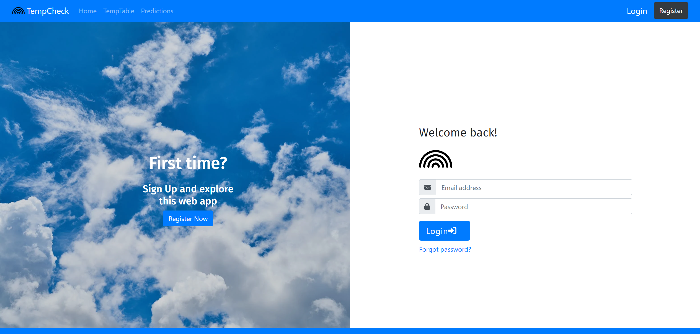

<div id="top"></div>

<!-- PROJECT LOGO -->
<br />
<div align="center">
  <a href="https://github.com/danny-rashd/TempCheck">
    
  </a>

  <h3 align="center">Temperature Web Application</h3>

  <p align="center">
    A web application that can visualize temperature data over time with registration and login page
    <br />
    <a href="https://github.com/danny-rashd/TempCheck"><strong>Explore the docs »</strong></a>
    <br />
    <br />
    <a href="https://github.com/danny-rashd/TempCheck">View Demo</a>
    ·
    <a href="https://github.com/danny-rashd/TempCheck/issues">Report Bug</a>
    ·
    <a href="https://github.com/danny-rashd/TempCheck/issues">Request Feature</a>
  </p>
</div>


<!-- TABLE OF CONTENTS -->
<details>
  <summary>Table of Contents</summary>
  <ol>
    <li>
      <a href="#about-the-project">About The Project</a>
      <ul>
        <li><a href="#built-with">Built With</a></li>
      </ul>
    </li>
    <li>
      <a href="#getting-started">Getting Started</a>
      <ul>
        <li><a href="#prerequisites">Prerequisites</a></li>
        <li><a href="#installation">Installation</a></li>
      </ul>
    </li>
    <li><a href="#usage">Usage</a></li>
    <li><a href="#contact">Contact</a></li>
    <li><a href="#acknowledgments">Acknowledgments</a></li>
  </ol>
</details>


<!-- ABOUT THE PROJECT -->
## About The Project



There are many great README templates available on GitHub; 

<p align="right">(<a href="#top">back to top</a>)</p>


### Built With

- [React js](https://reactjs.org/)
    - [React Bootstrap](https://react-bootstrap.github.io/)
- [Spring Boot](https://spring.io/projects/spring-boot)
    - [MySQL (Storing data)](https://spring.io/guides/gs/accessing-data-mysql/)
    - [MongoDB (File storing)](https://www.mongodb.com/compatibility/spring-boot)
- [Deeplearning4J (CUDA 11.2)](https://deeplearning4j.konduit.ai/multi-project/explanation/configuration/backends/cudnn)
- [Tensorflow (tf.keras)](https://www.tensorflow.org/versions/r1.15/api_docs/python/tf/keras#functions)

<p align="right">(<a href="#top">back to top</a>)</p>


<!-- GETTING STARTED -->
## Getting Started

Dataset can be downloaded [here](https://drive.google.com/drive/folders/1fC2uZmPriLh2QOvMVfvn7XnuWakIOZIw?usp=sharing).
### Prerequisites

* yarn
  ```sh
  npm install --global yarn
  ```


### Installation

1. Clone the repo
   ```sh
   git clone https://github.com/danny-rashd/TempCheck.git
   ```
2. Install yarn packages
   ```sh
   yarn
   ```
   
3. Generate app password to use Java Mail Sender https://myaccount.google.com/apppasswords

4. Insert your app email and password in `temperature-backend/src/main/resources/application.yml` 
   ```js
     mail:
    host: smtp.gmail.com
    port: 587
    username: '<user email to smtp server>'
    password: '<app password to smtp server>'
    properties:
      mail:
        smtp:
          auth: true
          starttls:
            enable: true
   ```

<p align="right">(<a href="#top">back to top</a>)</p>


<!-- USAGE EXAMPLES -->
## Usage


### Register 


### Login


### Upload file


### Upload file


<p align="right">(<a href="#top">back to top</a>)</p>

<!-- CONTACT -->
## Contact

[Danny Rashid](https://www.linkedin.com/in/dannyrashd/)

[danny.rashd@gmail.com](mailto:dannyrashd@gmail.com)

<p align="right">(<a href="#top">back to top</a>)</p>

<!-- ACKNOWLEDGMENTS -->
## Acknowledgments

* [Chart.js](https://www.chartjs.org/)
* [Papa parse](https://www.papaparse.com/)
* [Font Awesome Icons](https://fontawesome.com/icons/)
* [react-bootstrap-table2](https://react-bootstrap-table.github.io/react-bootstrap-table2/)

<p align="right">(<a href="#top">back to top</a>)</p>
