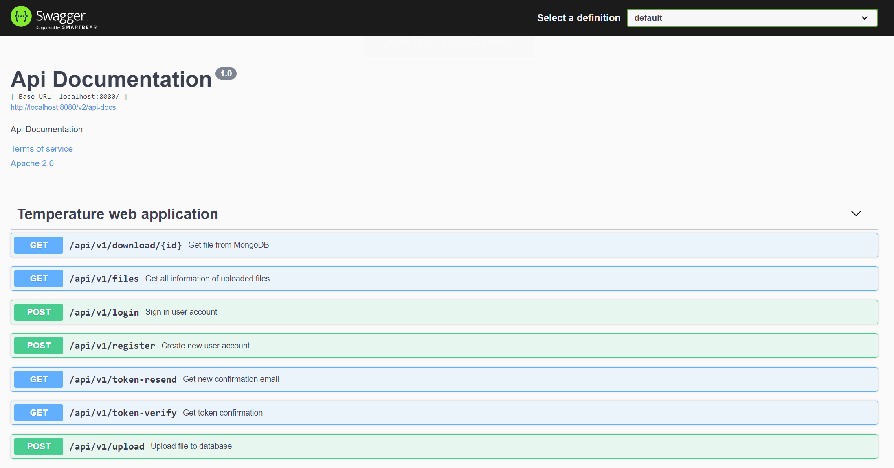
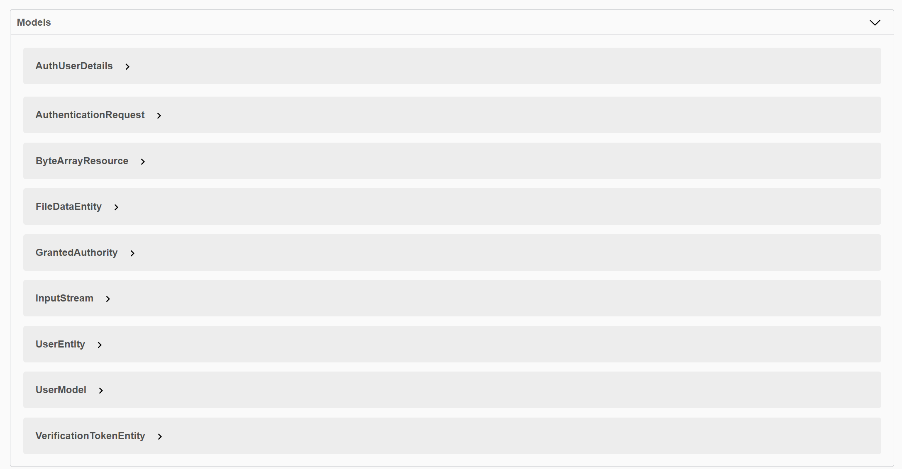

# TempCheck (temperature-backend)

This project uses Spring Boot, an open source Java-based framework used to create a micro Service.

If you want to learn more about Spring Boot, please visit its website: https://spring.io/projects/spring-boot .

## API Documentation

### REST API

### Models

## Related Guides

- Building REST services with Spring([guide](https://spring.io/guides/tutorials/rest/))
- React.js and Spring Data REST([guide](https://spring.io/guides/tutorials/react-and-spring-data-rest//))
- Accessing MongoDB Data with REST ([guide](https://spring.io/guides/gs/accessing-mongodb-data-rest/))
- Accessing data with MySQL ([guide](https://spring.io/guides/gs/accessing-data-mysql/))