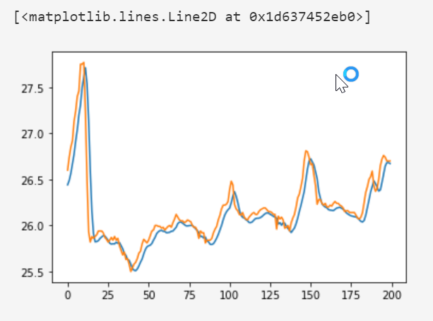
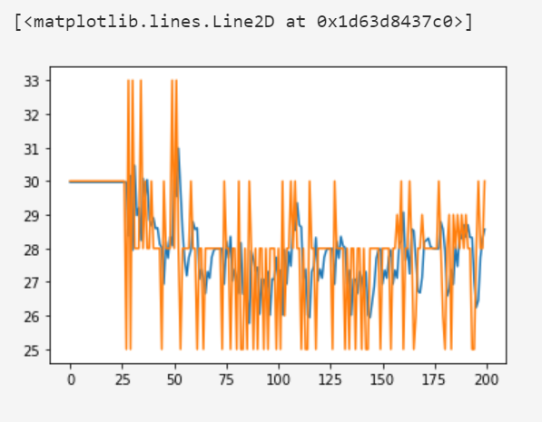
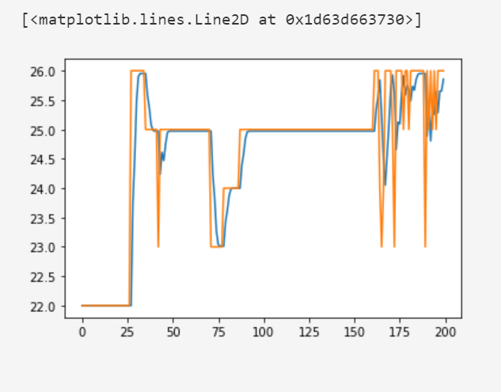
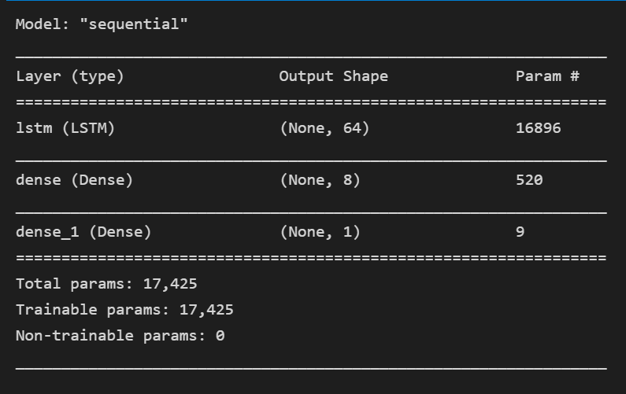

# Twitter Sentiment Analysis

The aim of this project is to build a web application that can predict the temperature of a given date.

## LSTM Time Series Model (Keras)

| Parameter                  | Value              |
| :--------                  | :----------        |
| `Model API`                | Sequential         |
| `Window size`              | 5                  |
| `Epoch`                    | 10                 |
| `Optimizer`                |  Adam              |
| `Learning Rate`            |  0.0001            |
| `InputLayer`               |  5,1               |
| `LSTM Layer`               |  64                |
| `Dense Layer`              |  8, relu           | 
| `Dense Layer`              |  1, linear         |
| `Loss function `           |Mean Absolute Error |
| `Metrics `                 | Root Mean Squared Error|

### Results of Predicted Temperature (Blue) against the Actual Temperature (Orange)

#### Training set

#### Validation set

#### Test set

## Screenshots

## Acknowledgements

 - [Time series forecasting (tensorflow)](https://www.tensorflow.org/tutorials/structured_data/time_series)
 - [Keras Import (deeplearning4j)](https://deeplearning4j.konduit.ai/deeplearning4j/how-to-guides/keras-import)
 - [Sequential Models (deeplearning4j)](https://deeplearning4j.konduit.ai/deeplearning4j/how-to-guides/keras-import/sequential-models)